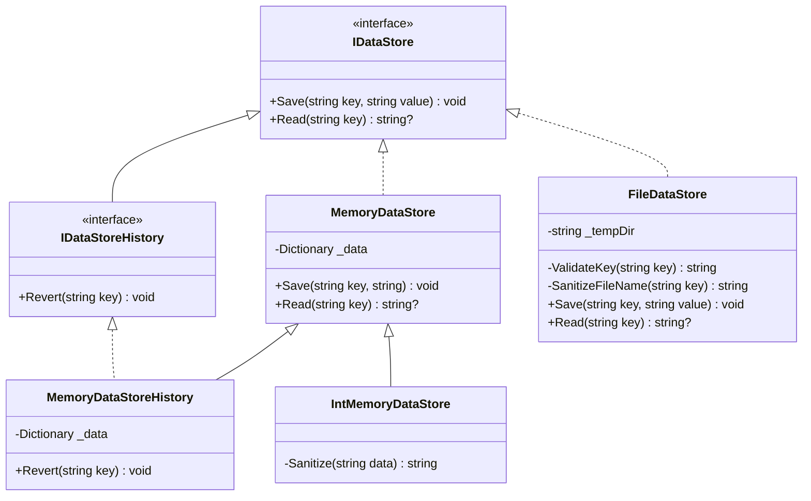

[](https://github.com/Raagam-Parmar/Assignment01/actions/workflows/build.yaml)

# Object Oriented Design Patterns

## What is a design pattern?

> _Each pattern describes a problem which occurs over
> and over again in our environment, and then describes the
> core of the solution to that problem, in such a way that 
> you can use this solution a million times
> over, without ever doing it the same way twice._
> -- Christopher Alexander in _**A Pattern Language**_

> _Design patterns capture the solutions to specific problems
> that have been developed and evolved over time._
> -- _**Elements of Reusable Object Oriented Programming**_

## What are the SOLID Principles?

SOLID is a mnemonic for five principles intended to make the source code
more understandable.

1. Single Responsibility Principle
2. Open-Close Principle
3. Liskov Substitution Principle (also known as Behavioural Subtyping)
4. Interface Segregation Principle
5. Dependency Inversion Principle

### Liskov Substitution Principle (Behavioural Subtyping)

We say a class $A$ is a _syntactic subtype_ of a class $B$,
if $A$ implements all the methods of $B$. For example, let $Bag$ be a class
implementing methods $Add$ and $Remove$. Let $Stack$ and $Queue$ be classes
which also implement the same methods. Hence, $Stack$ and $Queue$ are
_syntactic subtypes_ of $Bag$. Note that the converse may not hold, for
$Stack$ and $Queue$ may implement additional methods like $Peek$ and
$Length`.

However, this relation is too weak in practice, for if $Stack$ and $Queue$
implement the same methods, it allows one to be called a subtype of the
other, which would allow programs to use a $Queue$ when a $Stack$ is
expected and vice-versa. It fails to take into account the
_behavioural difference_ between a $Stack$ and a $Queue$.

Barbara Liskov introduced the concept of _behavioural subtyping_ in her
paper, **A Behavioural Notion of Subtyping**.

To specify a subtype relation between classes, a specification of client
expectations must be provided. The subtyping relation is with respect to
the said specification, and not the implementation of the superclass or
subclass.

#### Definition [(Wikipedia)](https://en.wikipedia.org/wiki/Behavioral_subtyping)

A type $S$ is a behavioural subtype of a type $T$ if each behaviour allowed
by the specification of $S$ is also allowed by the specification of $T$.
This requires, in particular, that for each method $m$ of $T$, the
specification of $m$ is _stronger_ than the one in $T$.

We say that a method specification given by precondition $P_s$ and
post-condition $Q_s$ is stronger than one given by precondition $P_t$ and
post-condition $Q_t$ if $P_s$ is _weaker_ than $P_t$ and $Q_s$ is _stronger_
than $Q_t$.

Formally, $P_t \implies P_s$ and $Q_s \implies Q_t$.

This allows clients expecting the supertype $T$ to pass parameters to the
methods of the subclass $S$ without violating $S$'s precondition, and
accept the returned values from its methods, without violating
the client expectations.

#### Example [(Wikipedia)](https://en.wikipedia.org/wiki/Behavioral_subtyping)

Assuming the intuitive specifications for $Stack$ and $Queue$, it is
easy to see that neither is a behavioural subtype of the other.
However, both of them are a behavioural subtype of a class which does not
specify the order in which items are stored, i.e., a $Bag$.

A client using a $Bag$ does not care about the order in which items are
retrieved, hence, an instance of $Stack$ or $Queue$ can be used safely in
place of a $Bag$ instance. However, it is easy to see why the converse
is not always true.

# Liskov Substitution Principle using Data Storage Providers

## Problem Statement

Design memory and file storage implementations that behave correctly
through one storage contract.

**Minimum Requirements:** State the contract clearly, implement at
least two substitutable providers; preserve save/read semantics and
error behaviour; run shared contract tests against every provider.

## Design


---

The project provides a few examples and counter examples for LSP.

### `IDataStore`

Specifies a contract describing the implementation of a data storage
provider. Data storage providers are abstracted as dictionaries in the
specification. The specified method `Save` adds an association of a `key`
and `value` to the dictionary; if an association is present, it is
overridden.

> [!NOTE]
> The implementation need not override the previous association for `key`.
> Read `IDataStoreHistory` for more information.

The specified method `Read` attempts to find the value associated with the
provided `key`. If no association is found, it returns `null`.

### `IDataStoreHistory`

Specifies a contract describing the implementation of a data storage
provider which also tracks the (linear) history of associations. The
mathematical model assumed for specification is a dictionary from
string to stack of strings.

The specified `Revert` method deletes the previously associated `value`
with `key` (if one exists).

Since `IDataStoreHistory` extends `IDataStore`, the former is a behavioural
subtype of the latter.

### `MemoryDataStore`

Implements `IDataStore`, where the association is stored in memory.

### `FileDataStore`

Implements `IDataStore`, where the association is stored in a temporary
file, with the value stored inside the file.

### `MemoryDataStoreHistory`

Implements `IDataStoreHistory` by extending `MemoryDataStore`.

### `IntMemoryDataStore`

Demonstrates two kinds of violation with the Liskov Substitution Principle.
It strengthens the precondition for `Save` by only allowing strings which
encode a positive or negative integer to be stored for `value`.
It also violates the post-condition for `Read` by returning the empty string
`""` instead of `null` if no association for `key` is found.

`IntMemoryDataStore` is a syntactic but not behavioural subtype of
`MemoryDataStore`.

## Limitations

`FileDataStore` stores key-value pairs by creating a temporary file
using the key and a unique filename, and storing the value inside the
file. Since there are some ASCII characters like `<` which can not be
part of a valid filename, the store replaces them with `_`. This introduces
collisions between keys such as `key<` and `key>`. Strictly speaking,
this strengthens the precondition on keys for `IDataStore`, breaking the
behavioural subtype relation. We can mitigate this by only
allowing alphanumeric characters `[a-zA-Z0-9] for the keys of the data
stores.

# Build

Uses on .NET 8.0

1. Restore dependencies

    ```powershell
    dotnet restore Assignment01.slnx
    ```

2. Build project

    ```powershell
    dotnet build Assignment01.slnx --no-restore --configuration Release
    ```

3. Run tests

    ```powershell
    dotnet test Assignment01.slnx --no-build --configuration Release --verbosity normal
    ```

4. Get code coverage
   
    ```powershell
    dotnet test --configuration Release --collect:"XPlat Code Coverage"
    ```

5.  Use Visual Studio extensions like
    [Fine Code Coverage](https://marketplace.visualstudio.com/items?itemName=FortuneNgwenya.FineCodeCoverage2022)
    to generate a pretty code coverage report.